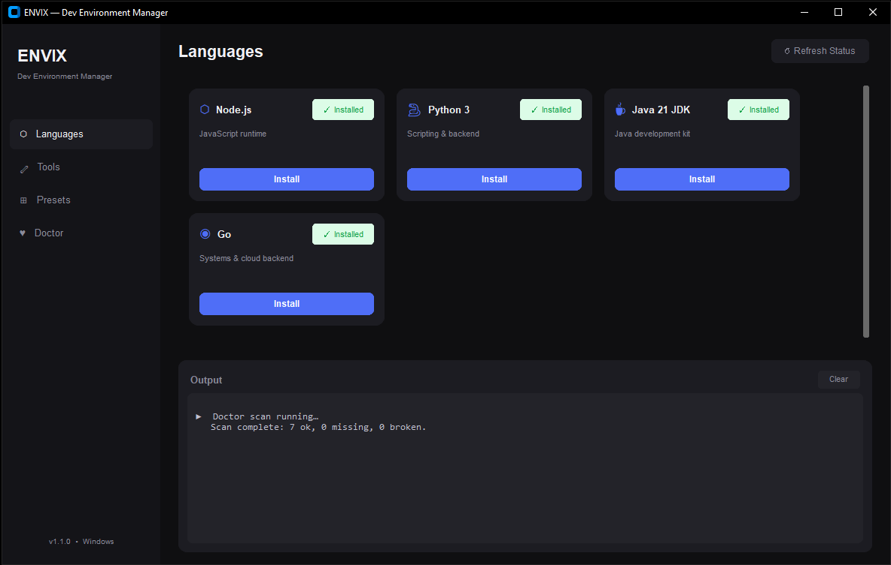
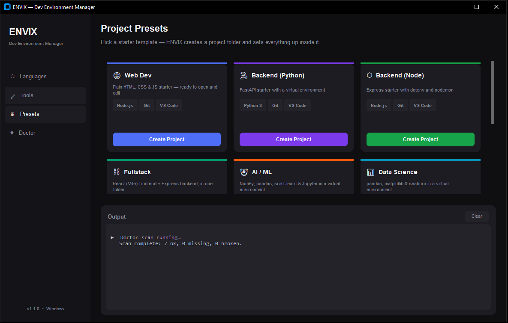
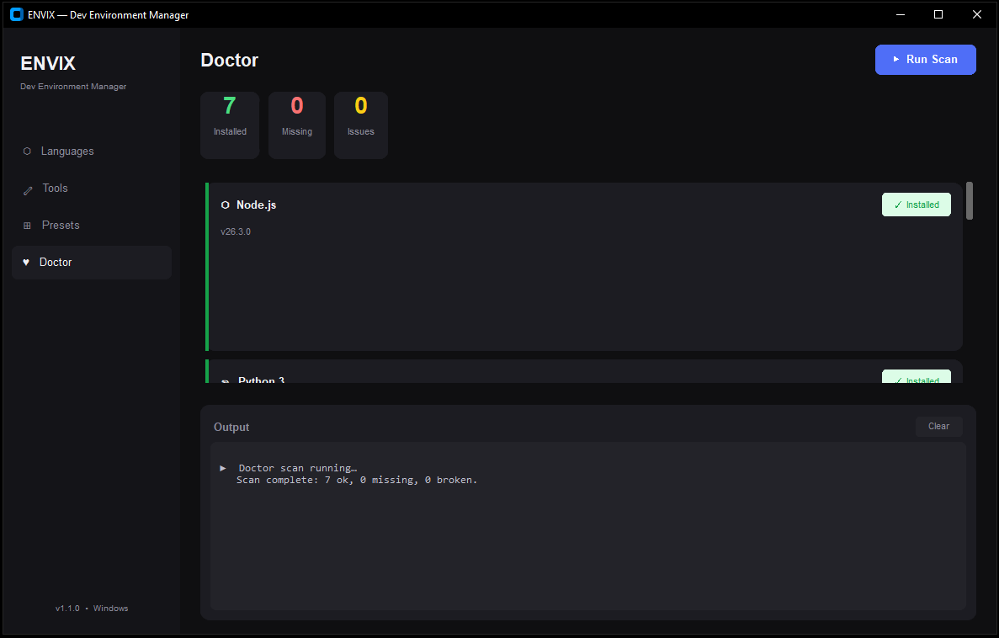

# ENVIX — Dev Environment Manager

Stop wasting time setting up development environments.

ENVIX is a modern desktop application that installs, configures, and fixes development environments on Windows — so you can start coding in minutes, not hours.

---

## What Problem Does ENVIX Solve?

Developers often spend:

- 15–30 minutes setting up environments
- fixing PATH errors
- watching tutorials for configuration
- reinstalling tools for every new project

ENVIX removes that pain.

---

## What ENVIX Does

With just a few clicks, ENVIX can:

- Install programming languages (Python, Node.js, Java, Go)
- Install essential developer tools (Git, VS Code, Docker)
- Automatically configure your system PATH
- Detect and fix environment issues (Doctor)
- Create complete development environments using Presets
- Install popular development packages from the new Package Hub

---

# Features

### 1. Language Installer

Install programming languages without manual setup or configuration errors.

### 2. Tools Setup

Install developer tools like Git, VS Code, Docker, and more with a single click.

### 3. Project Presets

Create complete development environments for:

- Web Development
- Backend (Python)
- Backend (Node.js)
- Fullstack
- AI / ML
- Data Science
- Game Development

Everything is pre-configured and ready to use.

### 4. Package Hub ⭐ NEW

Browse and install popular development packages directly from ENVIX.

No more searching for package names or remembering installation commands.

### 5. Doctor (Diagnostics)

Scans your system and:

- Detects missing tools
- Finds broken configurations
- Fixes common PATH issues

---

## Faster & Smoother UI

ENVIX has been rebuilt using **Tauri + React**, making the application significantly faster, lighter, and smoother than the original version while keeping the same simple workflow.

---

## Safety & Transparency

ENVIX is fully transparent.

- No hidden processes
- No background tracking
- Open source

⚠️ ENVIX installs software and modifies environment variables (PATH), which requires administrator permissions.

---

# Screenshots

---

## Current Status

ENVIX is currently in the MVP stage and is actively being improved based on developer feedback.

---

## Why ENVIX?

I built ENVIX because I experienced the same frustration every time I switched technologies or set up a new machine.

Instead of repeatedly installing tools, fixing configuration issues, and searching for setup guides, I wanted a single application that could prepare my development environment in minutes.

---

## Installation

1. Go to the **Releases** section.
2. Download the latest **.exe** installer.
3. Install ENVIX.
4. If Windows SmartScreen appears, click:
   - **More info**
   - **Run anyway**
5. Launch ENVIX.

No Python installation is required.

---

## Tech Stack

- Python
- FastAPI
- React
- TypeScript
- Tauri
- PyInstaller

---

## Feedback

I'm actively looking for feedback.

If you:

- Encounter bugs
- Have feature requests
- Have suggestions

Please open an Issue or contact me.

---

## Roadmap

- Linux support
- AI-powered VibeConfig
- Smarter diagnostics
- Enterprise management
- Team environments

---

## Team

Built by a solo founder passionate about simplifying developer workflows.

---

## Support

If you find ENVIX useful, please consider giving the repository a ⭐.

It helps the project reach more developers.